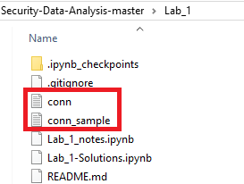

# Lab 1

## Introduction
This is a basic introduction to IPython and pandas functionality. <a href="http://pandas.pydata.org/">Pandas</a> (Python Data Analysis Library) "is an open source, BSD-licensed library providing high-performance, easy-to-use data structures and data analysis tools for the Python programming language." It (pandas) provides <a href="http://pandas.pydata.org/pandas-docs/stable/dsintro.html#dataframe">dataframe</a> functionality for reading/accessing/manipulating data in memory. You can think of a data frame as a table of indexed values.

What you're currently looking at is an IPython Notebook, this acts as a way to interactively use the python interpreter as well as a way to display graphs/charts/images/markdown along with code. IPython is commonly used in scientific computing due to its flexibility. Much more information is available on the <a href='http://ipython.org/'>IPython</a> website.

Often data is stored in files, and the first goal is to get that information off of disk and into a dataframe. Since we're working with limited resources in this VM we'll have to use samples of some of the files. Don't worry though, the same techniques apply if you're not sampling the files for exploration.

## Tip
If you ever want to know the various keyboard shortcuts, just click on a (non-code) cell or the text "In []" to the left of the cell, and press the *H* key. Or select *Help* from the menu above, and then *Keyboard Shortcuts*.
___

## Exercises

### File sampling
First off, let's take a look at a log file generated from <a href="http://www.bro.og/">Bro</a> this log is similar to netflow logs as well. However, this log file is rather large and doesn't fit in memory.

As part of the first exercise, figure out what setting the variable **sample_percent** should be in order to read in between 200k and 300k worth of (randomly selected) lines from the file. Change the variable, after doing that either click the *play* button above (it's the arrow) or hit the *[Shift]+[Enter]* keys as the same time.


```python
import random
logfile = 'conn.log'
sample_percent = .01
num_lines = sum(1 for line in open(logfile))
slines = set(sorted(random.sample(range(num_lines), int(num_lines * sample_percent))))
print("%s lines in %s, using a sample of %s lines" %(num_lines, logfile, len(slines)))
```

    22694356 lines in conn.log, using a sample of 226943 lines
    

<font color='blue'>
This notebook was previously coded using Python 2 so I had to make a couple of changes.
    
    
Debugging Comments: 
    
*  I modified the print statement 
  
* I kept getting a permission error. So I copied the log file from inside the conn.log directory folder
    
* xrange does not exist in Python 3 so I used range instead
</font>



### File Creation
Awesome! Now that you have a subset of lines to work with, let's write them to another file so we'll have something to practice reading in. Simply hit *[Shift]+[Enter]* below to run the code in the cell and create a new file.


```python
outfile = 'conn_sample.log'
f = open(outfile, 'w+')
i = open(logfile, 'r+')
linecount = 0
for line in i:
    if linecount in slines:
        f.write(line)
    linecount += 1
f.close()
i.close()
```

<font color='blue'>
This code creates a file called conn_sample.log and it contains a subset of data from the original file, conn.log. The file was created using a loop over logfile and a condition over slines. 
</font>

### File Input (CSV)
This next cell does a couple of things, first it imports pandas so we can create a dataframe, and then it reads our newly created file from above into memory. You can see the separator is specified to "\t" because Bro produces tab-delimited files by default. In this case we've also specified what we should call the columns in the dataframe.


```python
import pandas as pd
conn_df = pd.read_csv(outfile, sep="\t", header=None, names=['ts','uid','id.orig_h','id.orig_p','id.resp_h','id.resp_p','proto','service','duration','orig_bytes','resp_bytes','conn_state','local_orig','missed_bytes','history','orig_pkts','orig_ip_bytes','resp_pkts','resp_ip_bytes','tunnel_parents','threat','sample'])
```

<font color='blue'>
The data is read into a pandas dataframe, which helps for data manipulation and visualization. The file didn't contain any header with the column names, so they were inputted manually using the names variable.
</font>

### Verifying Input
Now (in theory) the contents of the file should be in a nicely laid-out dataframe.

For this next exercise, experiment with calling the **head()** and **tail()** method to see the values at the beginning and end of the dataframe. You can also pass a number to **head()** and **tail()** to specify the number of lines you want to see. Remember to click *play* or press *[Shift]+[Enter]* to execute the code in the cell after you change it.


```python
conn_df.head()
```


<div>
<style scoped>
    .dataframe tbody tr th:only-of-type {
        vertical-align: middle;
    }

    .dataframe tbody tr th {
        vertical-align: top;
    }

    .dataframe thead th {
        text-align: right;
    }
</style>
<table border="1" class="dataframe">
  <thead>
    <tr style="text-align: right;">
      <th></th>
      <th>ts</th>
      <th>uid</th>
      <th>id.orig_h</th>
      <th>id.orig_p</th>
      <th>id.resp_h</th>
      <th>id.resp_p</th>
      <th>proto</th>
      <th>service</th>
      <th>duration</th>
      <th>orig_bytes</th>
      <th>...</th>
      <th>local_orig</th>
      <th>missed_bytes</th>
      <th>history</th>
      <th>orig_pkts</th>
      <th>orig_ip_bytes</th>
      <th>resp_pkts</th>
      <th>resp_ip_bytes</th>
      <th>tunnel_parents</th>
      <th>threat</th>
      <th>sample</th>
    </tr>
  </thead>
  <tbody>
    <tr>
      <th>0</th>
      <td>1.331901e+09</td>
      <td>CzzTdG1vmwELxPECo6</td>
      <td>192.168.202.79</td>
      <td>46243</td>
      <td>192.168.229.254</td>
      <td>443</td>
      <td>tcp</td>
      <td>ssl</td>
      <td>0.020000</td>
      <td>539</td>
      <td>...</td>
      <td>-</td>
      <td>0</td>
      <td>ShADadfFr</td>
      <td>8</td>
      <td>963</td>
      <td>13</td>
      <td>1744</td>
      <td>(empty)</td>
      <td>NaN</td>
      <td>NaN</td>
    </tr>
    <tr>
      <th>1</th>
      <td>1.331901e+09</td>
      <td>C3WlGc3MKqYX4yew4i</td>
      <td>192.168.202.79</td>
      <td>50798</td>
      <td>192.168.229.251</td>
      <td>80</td>
      <td>tcp</td>
      <td>http</td>
      <td>0.020000</td>
      <td>173</td>
      <td>...</td>
      <td>-</td>
      <td>0</td>
      <td>ShADfFa</td>
      <td>4</td>
      <td>389</td>
      <td>3</td>
      <td>422</td>
      <td>(empty)</td>
      <td>NaN</td>
      <td>NaN</td>
    </tr>
    <tr>
      <th>2</th>
      <td>1.331901e+09</td>
      <td>CgyJe94ZUZCLDEm4Ed</td>
      <td>192.168.202.79</td>
      <td>46579</td>
      <td>192.168.229.254</td>
      <td>443</td>
      <td>tcp</td>
      <td>ssl</td>
      <td>0.010000</td>
      <td>547</td>
      <td>...</td>
      <td>-</td>
      <td>0</td>
      <td>ShADadfFr</td>
      <td>8</td>
      <td>971</td>
      <td>13</td>
      <td>1744</td>
      <td>(empty)</td>
      <td>NaN</td>
      <td>NaN</td>
    </tr>
    <tr>
      <th>3</th>
      <td>1.331901e+09</td>
      <td>CwV1MF8pLSHKwAQA4</td>
      <td>192.168.202.76</td>
      <td>51673</td>
      <td>149.5.45.166</td>
      <td>80</td>
      <td>tcp</td>
      <td>-</td>
      <td>3.000000</td>
      <td>0</td>
      <td>...</td>
      <td>-</td>
      <td>0</td>
      <td>S</td>
      <td>2</td>
      <td>104</td>
      <td>0</td>
      <td>0</td>
      <td>(empty)</td>
      <td>NaN</td>
      <td>NaN</td>
    </tr>
    <tr>
      <th>4</th>
      <td>1.331901e+09</td>
      <td>CyTR8y2igFLhViL5K3</td>
      <td>192.168.202.79</td>
      <td>57151</td>
      <td>192.168.229.251</td>
      <td>143</td>
      <td>tcp</td>
      <td>-</td>
      <td>-</td>
      <td>-</td>
      <td>...</td>
      <td>-</td>
      <td>0</td>
      <td>ShR</td>
      <td>2</td>
      <td>84</td>
      <td>1</td>
      <td>44</td>
      <td>(empty)</td>
      <td>NaN</td>
      <td>NaN</td>
    </tr>
  </tbody>
</table>
<p>5 rows × 22 columns</p>
</div>


<font color='blue'>
The command .head() gives us a peek at column names and some of the values in the conn.log dataset. By default it shows the top 5 rows. 
</font>

### Data Summarization
Now create a new cell below this one. This can be accomplished by clicking on this cell once, and then clicking the *+* icon towards the top or selecting *Insert* from above and then selecting *Insert Cell Below*. After creating the new cell, it's time to learn about the **describe()** method that can be called on dataframes. This will give you a numeric summarization of all columns that contain numbers.

Try it out!


```python
conn_df.describe()
```


<div>
<style scoped>
    .dataframe tbody tr th:only-of-type {
        vertical-align: middle;
    }

    .dataframe tbody tr th {
        vertical-align: top;
    }

    .dataframe thead th {
        text-align: right;
    }
</style>
<table border="1" class="dataframe">
  <thead>
    <tr style="text-align: right;">
      <th></th>
      <th>ts</th>
      <th>id.orig_p</th>
      <th>id.resp_p</th>
      <th>missed_bytes</th>
      <th>orig_pkts</th>
      <th>orig_ip_bytes</th>
      <th>resp_pkts</th>
      <th>resp_ip_bytes</th>
      <th>threat</th>
      <th>sample</th>
    </tr>
  </thead>
  <tbody>
    <tr>
      <th>count</th>
      <td>2.269430e+05</td>
      <td>226943.000000</td>
      <td>226943.000000</td>
      <td>226943.0</td>
      <td>226943.000000</td>
      <td>226943.000000</td>
      <td>226943.000000</td>
      <td>2.269430e+05</td>
      <td>0.0</td>
      <td>0.0</td>
    </tr>
    <tr>
      <th>mean</th>
      <td>1.331949e+09</td>
      <td>42723.213692</td>
      <td>20410.488506</td>
      <td>0.0</td>
      <td>1.372472</td>
      <td>121.946255</td>
      <td>0.836157</td>
      <td>1.558029e+02</td>
      <td>NaN</td>
      <td>NaN</td>
    </tr>
    <tr>
      <th>std</th>
      <td>4.276083e+04</td>
      <td>15336.893052</td>
      <td>20623.902724</td>
      <td>0.0</td>
      <td>6.463269</td>
      <td>1935.458915</td>
      <td>6.634548</td>
      <td>6.846186e+03</td>
      <td>NaN</td>
      <td>NaN</td>
    </tr>
    <tr>
      <th>min</th>
      <td>1.331901e+09</td>
      <td>0.000000</td>
      <td>0.000000</td>
      <td>0.0</td>
      <td>0.000000</td>
      <td>0.000000</td>
      <td>0.000000</td>
      <td>0.000000e+00</td>
      <td>NaN</td>
      <td>NaN</td>
    </tr>
    <tr>
      <th>25%</th>
      <td>1.331908e+09</td>
      <td>36044.000000</td>
      <td>2111.000000</td>
      <td>0.0</td>
      <td>1.000000</td>
      <td>44.000000</td>
      <td>0.000000</td>
      <td>0.000000e+00</td>
      <td>NaN</td>
      <td>NaN</td>
    </tr>
    <tr>
      <th>50%</th>
      <td>1.331928e+09</td>
      <td>44316.000000</td>
      <td>10180.000000</td>
      <td>0.0</td>
      <td>1.000000</td>
      <td>48.000000</td>
      <td>1.000000</td>
      <td>4.000000e+01</td>
      <td>NaN</td>
      <td>NaN</td>
    </tr>
    <tr>
      <th>75%</th>
      <td>1.331997e+09</td>
      <td>54494.000000</td>
      <td>37786.000000</td>
      <td>0.0</td>
      <td>1.000000</td>
      <td>60.000000</td>
      <td>1.000000</td>
      <td>4.000000e+01</td>
      <td>NaN</td>
      <td>NaN</td>
    </tr>
    <tr>
      <th>max</th>
      <td>1.332018e+09</td>
      <td>65534.000000</td>
      <td>65535.000000</td>
      <td>0.0</td>
      <td>1034.000000</td>
      <td>718677.000000</td>
      <td>1894.000000</td>
      <td>2.684428e+06</td>
      <td>NaN</td>
      <td>NaN</td>
    </tr>
  </tbody>
</table>
</div>


<font color='blue'>
The command .describe() is handy to look at the summary statistics of the dataset. 
</font>

### Data Types
Wait a second, isn't the ts column supposed to be a timestamp? Perhaps this column would be better suited as a time data type vs. a number.

Run the cell below to see what type of information Python stored in each column.


```python
conn_df.dtypes
```


    ts                float64
    uid                object
    id.orig_h          object
    id.orig_p           int64
    id.resp_h          object
    id.resp_p           int64
    proto              object
    service            object
    duration           object
    orig_bytes         object
    resp_bytes         object
    conn_state         object
    local_orig         object
    missed_bytes        int64
    history            object
    orig_pkts           int64
    orig_ip_bytes       int64
    resp_pkts           int64
    resp_ip_bytes       int64
    tunnel_parents     object
    threat            float64
    sample            float64
    dtype: object


### Converting Column Types
Time to change the ts column to a datetime object! We will accomplish that by using a simple function provided called *to_datetime()*. The cell below runs this function on the ts column (what should be a time stamp), and then re-assigns this column back to the dataframe in the same place. A new timestamp column could have been added to the dataframe as well so both the float value and the datetime object columns are present.

Run the cell below to convert the column type.


```python
from datetime import datetime
conn_df['ts'] = [datetime.fromtimestamp(float(date)) for date in conn_df['ts'].values]
```

<font color='blue'>
The code uses a for loop to convert the ts column to a datetime object. Another option could be using an apply command: conn_df['ts'].apply(pandas.to_datetime)
</font>


```python
conn_df.dtypes
```


    ts                datetime64[ns]
    uid                       object
    id.orig_h                 object
    id.orig_p                  int64
    id.resp_h                 object
    id.resp_p                  int64
    proto                     object
    service                   object
    duration                  object
    orig_bytes                object
    resp_bytes                object
    conn_state                object
    local_orig                object
    missed_bytes               int64
    history                   object
    orig_pkts                  int64
    orig_ip_bytes              int64
    resp_pkts                  int64
    resp_ip_bytes              int64
    tunnel_parents            object
    threat                   float64
    sample                   float64
    dtype: object


```python
conn_df.head()
```


<div>
<style scoped>
    .dataframe tbody tr th:only-of-type {
        vertical-align: middle;
    }

    .dataframe tbody tr th {
        vertical-align: top;
    }

    .dataframe thead th {
        text-align: right;
    }
</style>
<table border="1" class="dataframe">
  <thead>
    <tr style="text-align: right;">
      <th></th>
      <th>ts</th>
      <th>uid</th>
      <th>id.orig_h</th>
      <th>id.orig_p</th>
      <th>id.resp_h</th>
      <th>id.resp_p</th>
      <th>proto</th>
      <th>service</th>
      <th>duration</th>
      <th>orig_bytes</th>
      <th>...</th>
      <th>local_orig</th>
      <th>missed_bytes</th>
      <th>history</th>
      <th>orig_pkts</th>
      <th>orig_ip_bytes</th>
      <th>resp_pkts</th>
      <th>resp_ip_bytes</th>
      <th>tunnel_parents</th>
      <th>threat</th>
      <th>sample</th>
    </tr>
  </thead>
  <tbody>
    <tr>
      <th>0</th>
      <td>2012-03-16 05:30:00.810</td>
      <td>CzzTdG1vmwELxPECo6</td>
      <td>192.168.202.79</td>
      <td>46243</td>
      <td>192.168.229.254</td>
      <td>443</td>
      <td>tcp</td>
      <td>ssl</td>
      <td>0.020000</td>
      <td>539</td>
      <td>...</td>
      <td>-</td>
      <td>0</td>
      <td>ShADadfFr</td>
      <td>8</td>
      <td>963</td>
      <td>13</td>
      <td>1744</td>
      <td>(empty)</td>
      <td>NaN</td>
      <td>NaN</td>
    </tr>
    <tr>
      <th>1</th>
      <td>2012-03-16 05:30:03.080</td>
      <td>C3WlGc3MKqYX4yew4i</td>
      <td>192.168.202.79</td>
      <td>50798</td>
      <td>192.168.229.251</td>
      <td>80</td>
      <td>tcp</td>
      <td>http</td>
      <td>0.020000</td>
      <td>173</td>
      <td>...</td>
      <td>-</td>
      <td>0</td>
      <td>ShADfFa</td>
      <td>4</td>
      <td>389</td>
      <td>3</td>
      <td>422</td>
      <td>(empty)</td>
      <td>NaN</td>
      <td>NaN</td>
    </tr>
    <tr>
      <th>2</th>
      <td>2012-03-16 05:30:04.360</td>
      <td>CgyJe94ZUZCLDEm4Ed</td>
      <td>192.168.202.79</td>
      <td>46579</td>
      <td>192.168.229.254</td>
      <td>443</td>
      <td>tcp</td>
      <td>ssl</td>
      <td>0.010000</td>
      <td>547</td>
      <td>...</td>
      <td>-</td>
      <td>0</td>
      <td>ShADadfFr</td>
      <td>8</td>
      <td>971</td>
      <td>13</td>
      <td>1744</td>
      <td>(empty)</td>
      <td>NaN</td>
      <td>NaN</td>
    </tr>
    <tr>
      <th>3</th>
      <td>2012-03-16 05:30:08.740</td>
      <td>CwV1MF8pLSHKwAQA4</td>
      <td>192.168.202.76</td>
      <td>51673</td>
      <td>149.5.45.166</td>
      <td>80</td>
      <td>tcp</td>
      <td>-</td>
      <td>3.000000</td>
      <td>0</td>
      <td>...</td>
      <td>-</td>
      <td>0</td>
      <td>S</td>
      <td>2</td>
      <td>104</td>
      <td>0</td>
      <td>0</td>
      <td>(empty)</td>
      <td>NaN</td>
      <td>NaN</td>
    </tr>
    <tr>
      <th>4</th>
      <td>2012-03-16 05:30:12.480</td>
      <td>CyTR8y2igFLhViL5K3</td>
      <td>192.168.202.79</td>
      <td>57151</td>
      <td>192.168.229.251</td>
      <td>143</td>
      <td>tcp</td>
      <td>-</td>
      <td>-</td>
      <td>-</td>
      <td>...</td>
      <td>-</td>
      <td>0</td>
      <td>ShR</td>
      <td>2</td>
      <td>84</td>
      <td>1</td>
      <td>44</td>
      <td>(empty)</td>
      <td>NaN</td>
      <td>NaN</td>
    </tr>
  </tbody>
</table>
<p>5 rows × 22 columns</p>
</div>


<font color='blue'>
Looking at the results above, the conversion was successful. The ts column is now in datetime format. 
</font>

### Data Value Exploration
Verify that the conversion was successful. What is the datatype of the column now?

Scroll back up the page and note where you ran the **describe()** function. You'll see under the threat and sample columns there is likely the value of *NaN*. This stands for Not a Number and is a special value assigned to empty column values. There are a few ways to explore what values a column has. Two of these are **value_counts()** and **unique()**. 

Try them below on different columns. You can create new cells or if you want to get more than the last command worth of output you can put a print statement in front. 

What happens when you run them on a column with IPs (*id.orig_h, id.resp_h*)? What about sample or threat?


```python
conn_df['sample'].unique()
```


    array([nan])


```python
conn_df['id.orig_h'].unique()
```


    array(['192.168.202.79', '192.168.202.76', '192.168.202.71',
           '192.168.202.100', 'fe80::216:47ff:fe9d:f2c3', '192.168.202.85',
           '192.168.202.89', '192.168.202.97', '192.168.202.103',
           '192.168.203.61', 'fe80::c62c:3ff:fe37:efc', '192.168.202.83',
           '2001:dbb:c18:155:2449:14f1:f324:7497', '192.168.202.101',
           '192.168.202.93', '192.168.203.62', '192.168.202.106',
           '192.168.204.70', '192.168.202.81', '192.168.202.108',
           '192.168.202.73', '192.168.202.96', 'fe80::20c:29ff:fef0:f164',
           '192.168.202.102', '192.168.202.75', '192.168.202.110', '0.0.0.0',
           '192.168.203.45', '192.168.204.45', '192.168.202.87',
           'fe80::216:47ff:fe9d:f2c2', '192.168.27.103',
           'fe80::216:47ff:fe9d:f2d4', '192.168.202.65', '192.168.202.116',
           '192.168.202.68', '192.168.203.63', '::', '192.168.202.115',
           '192.168.27.102', '192.168.202.90', '192.168.26.100',
           '192.168.51.38', '192.168.24.100', '192.168.203.64', '172.19.2.66',
           '192.168.202.94', 'fe80::c62c:3ff:fe30:7333', '192.168.202.95',
           '192.168.202.109', '192.168.28.100', '192.168.202.80',
           '192.168.27.100', 'fe80::216:47ff:fe9d:f2c5', '192.168.202.112',
           '192.168.202.84', 'fe80::216:47ff:fe9d:f2d5',
           'fe80::216:47ff:fe9d:f2c8', 'fe80::216:47ff:fe9d:f2d6',
           '192.168.204.1', '192.168.202.1', 'fe80::216:47ff:fe9d:f2c7',
           '192.168.202.63', 'fe80::216:47ff:fe9d:f2c4', '192.168.204.57',
           '192.168.207.4', '192.168.202.117', '192.168.202.107',
           '192.168.202.88', '192.168.229.156', '192.168.22.253',
           '192.168.22.252', '192.168.202.77', 'fe80::216:47ff:fe9d:f2c1',
           'fe80::20c:29ff:fe4e:9e86', 'fe80::20c:29ff:fe93:209e',
           '192.168.202.92', 'fe80::4c3a:e571:4cfc:b70c', '192.168.205.253',
           '192.168.202.78', '10.10.117.209', '192.168.202.49',
           '192.168.27.25', '192.168.25.25', '192.168.28.25',
           '192.168.202.91', '192.168.202.119', '192.168.229.252',
           '192.168.26.254', '192.168.202.113', '192.168.26.25',
           '192.168.202.118', '192.168.23.25', 'fe80::4c9b:aad8:8a6a:7bb0',
           'fe80::9c8a:5786:bbb0:3db8', '192.168.202.121', '172.16.6.57',
           '2001:dbb:c18:202:20c:29ff:fe93:571e', '192.168.204.60',
           '192.168.22.25', '192.168.25.100', '192.168.24.25',
           '192.168.25.203', 'fe80::a800:4ff:fe00:a04',
           '2001:dbb:c18:204:a800:4ff:fe00:a04', '192.168.202.123',
           'fe80::4172:3555:4717:3e0c', '192.168.21.25',
           'fe80::65ca:c6cd:7ae0:ac8c', '2001:dbb:c18:204:20c:29ff:fe4e:9e86',
           'fe80::5e26:aff:fe6a:4084', '192.168.25.152', '192.168.202.69',
           '2001:dbb:c18:202:d4bc:e39f:84ad:5001', '192.168.202.122',
           '192.168.202.125', '192.168.21.1', '192.168.21.203',
           '192.168.23.202', '10.10.10.10', 'fe80::62fb:42ff:feef:5440',
           '192.168.202.98', '192.168.202.120', '192.168.202.129',
           '192.168.202.4', 'fe80::226:9eff:fe23:5ee4', '192.168.21.202',
           'fe80::3e07:54ff:fe1c:a665', '192.168.202.131', '192.168.21.103',
           '192.168.23.100', '192.168.204.59', '192.168.202.64',
           '192.168.227.83', '192.168.202.138', '192.168.203.65',
           '192.168.203.66', 'fe80::bc5c:15c1:ec81:1e08', '192.168.202.140',
           '192.168.202.139', 'fe80::beae:c5ff:fe9e:f3b6', '192.168.202.141',
           '192.168.202.133', '192.168.202.137', 'fe80::d69a:20ff:fef9:b49c',
           '192.168.202.135', '192.168.202.143',
           '2001:dbb:c18:202:20c:29ff:fe18:b667', 'fe80::20c:29ff:fe8e:385a',
           '192.168.202.144', '2001:dbb:c18:202:20c:29ff:fe41:4be7',
           'fe80::11a:f507:d853:a03d', '192.168.202.222', '192.168.202.240',
           '172.16.6.100', 'fe80::2c0:caff:fe5f:6869', '192.168.27.152',
           '2001:dbb:c18:202:20c:29ff:febd:1154', '192.168.202.136',
           '192.168.202.149', '2001:dbb:c18:202:a800:4ff:fe00:a04',
           'fe80::216:47ff:fe9d:f2c6', 'fe80::21d:72ff:fe8c:a569',
           '192.168.202.44', '192.168.202.41', '192.168.202.43',
           'fe80::ba8d:12ff:fe53:a8d8', '192.168.202.145', '192.168.202.152',
           '192.168.202.62', 'fe80::dcad:beff:feef:beef', '192.168.21.254',
           '192.168.27.1', '192.168.202.153', '192.168.202.33',
           '192.168.202.40', '192.168.202.150',
           '2001:dbb:c18:202:223:dfff:fe97:4e12', 'fe80::d840:5635:ef48:b032',
           '192.168.202.157', '192.168.202.42', '192.168.202.155'],
          dtype=object)


```python
conn_df['id.resp_h'].value_counts()
```


    192.168.206.44              49025
    192.168.22.254               4333
    192.168.229.254              4302
    192.168.229.101              3549
    192.168.27.102               3505
    192.168.27.100               3337
    192.168.23.1                 3233
    192.168.27.254               3174
    192.168.27.101               3166
    192.168.28.25                3101
    192.168.27.1                 3083
    192.168.24.253               3001
    192.168.22.1                 2769
    192.168.229.156              2756
    192.168.229.251              2698
    192.168.21.100               2683
    192.168.27.253               2611
    192.168.229.252              2564
    192.168.22.253               2502
    192.168.229.153              2502
    192.168.229.1                2452
    192.168.27.103               2443
    192.168.22.252               2428
    192.168.22.25                2371
    192.168.21.1                 2213
    192.168.27.152               2210
    192.168.21.25                2061
    192.168.21.103               1967
    192.168.28.202               1965
    192.168.24.202               1856
                                ...  
    192.168.26.214                  1
    172.16.3.121                    1
    192.168.26.233                  1
    172.16.7.185                    1
    172.16.4.254                    1
    172.16.8.159                    1
    172.16.3.176                    1
    192.168.23.243                  1
    192.168.27.204                  1
    192.168.23.158                  1
    172.16.3.73                     1
    172.16.5.223                    1
    172.16.5.87                     1
    172.16.8.23                     1
    111.221.77.147                  1
    192.168.229.208                 1
    172.16.7.203                    1
    172.16.1.231                    1
    192.168.229.109                 1
    172.16.1.103                    1
    192.168.26.250                  1
    192.168.26.168                  1
    ff02::1:ff53:a8d8               1
    192.168.26.211                  1
    192.168.202.100                 1
    172.16.4.108                    1
    192.168.22.214                  1
    172.16.8.171                    1
    fe80::20c:29ff:fe93:209e        1
    172.16.7.9                      1
    Name: id.resp_h, Length: 2750, dtype: int64


```python
conn_df['threat'].unique()
```


    array([nan])


<font color='blue'>
The values in the threat and sample columns are NaN while the values in the id.orig_h and id.resp_h are IPv4 or IPv6 addresses.
    
The command .unique() list the unique values. The command .value_counts() shows the counts of each value in descending order. 
</font>

### Remove Columns
Another useful operation on a dataframe is removing and adding columns.  Since the threat and sample columns contain only *NaNs*, we can safely remove them and not impact any analysis that may be performed. 

Below the sample column is removed (dropped), add a similar line to drop the *threat* column and use a method from above to verify they are no longer in the dataframe.


```python
conn_df.drop('sample', axis=1, inplace=True)
```

Can you think of other columns to remove? Select a few and remove them as well. What does your dataframe look like now? (Insert additional cells as needed)


```python
conn_df.drop('threat', axis=1, inplace=True)
```

<font color='blue'>
Looking at the unique values in the local_orig column, I would also remove it from the dataset. This column does not seem useful for analysis.
</font>


```python
conn_df['local_orig'].unique()
```


    array(['-'], dtype=object)


```python
conn_df.drop('local_orig', axis=1, inplace=True)
```

<font color='blue'>
Instead of dropping the columns, we can also replace the values with number zero or the string 'NA'.
</font>


```python
conn_df.head()
```


<div>
<style scoped>
    .dataframe tbody tr th:only-of-type {
        vertical-align: middle;
    }

    .dataframe tbody tr th {
        vertical-align: top;
    }

    .dataframe thead th {
        text-align: right;
    }
</style>
<table border="1" class="dataframe">
  <thead>
    <tr style="text-align: right;">
      <th></th>
      <th>ts</th>
      <th>uid</th>
      <th>id.orig_h</th>
      <th>id.orig_p</th>
      <th>id.resp_h</th>
      <th>id.resp_p</th>
      <th>proto</th>
      <th>service</th>
      <th>duration</th>
      <th>orig_bytes</th>
      <th>resp_bytes</th>
      <th>conn_state</th>
      <th>missed_bytes</th>
      <th>history</th>
      <th>orig_pkts</th>
      <th>orig_ip_bytes</th>
      <th>resp_pkts</th>
      <th>resp_ip_bytes</th>
      <th>tunnel_parents</th>
    </tr>
  </thead>
  <tbody>
    <tr>
      <th>0</th>
      <td>2012-03-16 05:30:00.810</td>
      <td>CzzTdG1vmwELxPECo6</td>
      <td>192.168.202.79</td>
      <td>46243</td>
      <td>192.168.229.254</td>
      <td>443</td>
      <td>tcp</td>
      <td>ssl</td>
      <td>0.020000</td>
      <td>539</td>
      <td>1060</td>
      <td>SF</td>
      <td>0</td>
      <td>ShADadfFr</td>
      <td>8</td>
      <td>963</td>
      <td>13</td>
      <td>1744</td>
      <td>(empty)</td>
    </tr>
    <tr>
      <th>1</th>
      <td>2012-03-16 05:30:03.080</td>
      <td>C3WlGc3MKqYX4yew4i</td>
      <td>192.168.202.79</td>
      <td>50798</td>
      <td>192.168.229.251</td>
      <td>80</td>
      <td>tcp</td>
      <td>http</td>
      <td>0.020000</td>
      <td>173</td>
      <td>254</td>
      <td>SF</td>
      <td>0</td>
      <td>ShADfFa</td>
      <td>4</td>
      <td>389</td>
      <td>3</td>
      <td>422</td>
      <td>(empty)</td>
    </tr>
    <tr>
      <th>2</th>
      <td>2012-03-16 05:30:04.360</td>
      <td>CgyJe94ZUZCLDEm4Ed</td>
      <td>192.168.202.79</td>
      <td>46579</td>
      <td>192.168.229.254</td>
      <td>443</td>
      <td>tcp</td>
      <td>ssl</td>
      <td>0.010000</td>
      <td>547</td>
      <td>1060</td>
      <td>SF</td>
      <td>0</td>
      <td>ShADadfFr</td>
      <td>8</td>
      <td>971</td>
      <td>13</td>
      <td>1744</td>
      <td>(empty)</td>
    </tr>
    <tr>
      <th>3</th>
      <td>2012-03-16 05:30:08.740</td>
      <td>CwV1MF8pLSHKwAQA4</td>
      <td>192.168.202.76</td>
      <td>51673</td>
      <td>149.5.45.166</td>
      <td>80</td>
      <td>tcp</td>
      <td>-</td>
      <td>3.000000</td>
      <td>0</td>
      <td>0</td>
      <td>S0</td>
      <td>0</td>
      <td>S</td>
      <td>2</td>
      <td>104</td>
      <td>0</td>
      <td>0</td>
      <td>(empty)</td>
    </tr>
    <tr>
      <th>4</th>
      <td>2012-03-16 05:30:12.480</td>
      <td>CyTR8y2igFLhViL5K3</td>
      <td>192.168.202.79</td>
      <td>57151</td>
      <td>192.168.229.251</td>
      <td>143</td>
      <td>tcp</td>
      <td>-</td>
      <td>-</td>
      <td>-</td>
      <td>-</td>
      <td>RSTO</td>
      <td>0</td>
      <td>ShR</td>
      <td>2</td>
      <td>84</td>
      <td>1</td>
      <td>44</td>
      <td>(empty)</td>
    </tr>
  </tbody>
</table>
</div>


<font color='blue'>
Looking at the results, the columns threat, sample, and local_orig has been removed. 
</font>

### Row Selection

You can use column values to select rows from the dataframes (and even only view specific columns). First, select all rows that contain *SSL* traffic by running the cell below.


```python
conn_df[conn_df['service'] == 'ssl'].head()
```


<div>
<style scoped>
    .dataframe tbody tr th:only-of-type {
        vertical-align: middle;
    }

    .dataframe tbody tr th {
        vertical-align: top;
    }

    .dataframe thead th {
        text-align: right;
    }
</style>
<table border="1" class="dataframe">
  <thead>
    <tr style="text-align: right;">
      <th></th>
      <th>ts</th>
      <th>uid</th>
      <th>id.orig_h</th>
      <th>id.orig_p</th>
      <th>id.resp_h</th>
      <th>id.resp_p</th>
      <th>proto</th>
      <th>service</th>
      <th>duration</th>
      <th>orig_bytes</th>
      <th>resp_bytes</th>
      <th>conn_state</th>
      <th>missed_bytes</th>
      <th>history</th>
      <th>orig_pkts</th>
      <th>orig_ip_bytes</th>
      <th>resp_pkts</th>
      <th>resp_ip_bytes</th>
      <th>tunnel_parents</th>
    </tr>
  </thead>
  <tbody>
    <tr>
      <th>0</th>
      <td>2012-03-16 05:30:00.810</td>
      <td>CzzTdG1vmwELxPECo6</td>
      <td>192.168.202.79</td>
      <td>46243</td>
      <td>192.168.229.254</td>
      <td>443</td>
      <td>tcp</td>
      <td>ssl</td>
      <td>0.020000</td>
      <td>539</td>
      <td>1060</td>
      <td>SF</td>
      <td>0</td>
      <td>ShADadfFr</td>
      <td>8</td>
      <td>963</td>
      <td>13</td>
      <td>1744</td>
      <td>(empty)</td>
    </tr>
    <tr>
      <th>2</th>
      <td>2012-03-16 05:30:04.360</td>
      <td>CgyJe94ZUZCLDEm4Ed</td>
      <td>192.168.202.79</td>
      <td>46579</td>
      <td>192.168.229.254</td>
      <td>443</td>
      <td>tcp</td>
      <td>ssl</td>
      <td>0.010000</td>
      <td>547</td>
      <td>1060</td>
      <td>SF</td>
      <td>0</td>
      <td>ShADadfFr</td>
      <td>8</td>
      <td>971</td>
      <td>13</td>
      <td>1744</td>
      <td>(empty)</td>
    </tr>
    <tr>
      <th>5765</th>
      <td>2012-03-16 05:47:37.420</td>
      <td>Cy7R1f3DzWehzZlaLd</td>
      <td>192.168.202.79</td>
      <td>52473</td>
      <td>192.168.229.254</td>
      <td>443</td>
      <td>tcp</td>
      <td>ssl</td>
      <td>0.260000</td>
      <td>558</td>
      <td>1060</td>
      <td>SF</td>
      <td>0</td>
      <td>ShADadfFr</td>
      <td>15</td>
      <td>1346</td>
      <td>13</td>
      <td>1744</td>
      <td>(empty)</td>
    </tr>
    <tr>
      <th>5829</th>
      <td>2012-03-16 05:47:49.640</td>
      <td>CpdleG4wcHvlh7jBU4</td>
      <td>192.168.202.79</td>
      <td>52955</td>
      <td>192.168.229.254</td>
      <td>443</td>
      <td>tcp</td>
      <td>ssl</td>
      <td>0.260000</td>
      <td>545</td>
      <td>1060</td>
      <td>SF</td>
      <td>0</td>
      <td>ShADadfrF</td>
      <td>15</td>
      <td>1333</td>
      <td>13</td>
      <td>1744</td>
      <td>(empty)</td>
    </tr>
    <tr>
      <th>5892</th>
      <td>2012-03-16 05:48:02.630</td>
      <td>CkpUlX1s6SqzuCJEnf</td>
      <td>192.168.202.79</td>
      <td>53335</td>
      <td>192.168.229.254</td>
      <td>443</td>
      <td>tcp</td>
      <td>ssl</td>
      <td>0.260000</td>
      <td>546</td>
      <td>1060</td>
      <td>SF</td>
      <td>0</td>
      <td>ShADadfrF</td>
      <td>15</td>
      <td>1334</td>
      <td>13</td>
      <td>1744</td>
      <td>(empty)</td>
    </tr>
  </tbody>
</table>
</div>


Next we can assign that result to a dataframe, and then look at all all the *SSL* connections that happen over ports other than 443.


```python
ssl_df = conn_df[conn_df['service'] == 'ssl']
ssl_df[ssl_df['id.resp_p'] != 443].head()
```


<div>
<style scoped>
    .dataframe tbody tr th:only-of-type {
        vertical-align: middle;
    }

    .dataframe tbody tr th {
        vertical-align: top;
    }

    .dataframe thead th {
        text-align: right;
    }
</style>
<table border="1" class="dataframe">
  <thead>
    <tr style="text-align: right;">
      <th></th>
      <th>ts</th>
      <th>uid</th>
      <th>id.orig_h</th>
      <th>id.orig_p</th>
      <th>id.resp_h</th>
      <th>id.resp_p</th>
      <th>proto</th>
      <th>service</th>
      <th>duration</th>
      <th>orig_bytes</th>
      <th>resp_bytes</th>
      <th>conn_state</th>
      <th>missed_bytes</th>
      <th>history</th>
      <th>orig_pkts</th>
      <th>orig_ip_bytes</th>
      <th>resp_pkts</th>
      <th>resp_ip_bytes</th>
      <th>tunnel_parents</th>
    </tr>
  </thead>
  <tbody>
    <tr>
      <th>41277</th>
      <td>2012-03-16 06:32:55.860</td>
      <td>Cd0faF3BHwypesYLS5</td>
      <td>192.168.202.110</td>
      <td>47416</td>
      <td>192.168.27.253</td>
      <td>8089</td>
      <td>tcp</td>
      <td>ssl</td>
      <td>0.430000</td>
      <td>745</td>
      <td>1816</td>
      <td>RSTO</td>
      <td>0</td>
      <td>ShADadfR</td>
      <td>10</td>
      <td>1273</td>
      <td>6</td>
      <td>2136</td>
      <td>(empty)</td>
    </tr>
    <tr>
      <th>41567</th>
      <td>2012-03-16 06:33:40.960</td>
      <td>CCqJ9U1kyQJ2gimpCj</td>
      <td>192.168.202.110</td>
      <td>48971</td>
      <td>192.168.27.253</td>
      <td>8089</td>
      <td>tcp</td>
      <td>ssl</td>
      <td>0.160000</td>
      <td>713</td>
      <td>1816</td>
      <td>RSTO</td>
      <td>0</td>
      <td>ShADadfR</td>
      <td>8</td>
      <td>1137</td>
      <td>6</td>
      <td>2136</td>
      <td>(empty)</td>
    </tr>
    <tr>
      <th>41575</th>
      <td>2012-03-16 06:33:43.160</td>
      <td>CdIJrf2YD0GxxnqS8l</td>
      <td>192.168.202.110</td>
      <td>49030</td>
      <td>192.168.27.253</td>
      <td>8089</td>
      <td>tcp</td>
      <td>ssl</td>
      <td>0.030000</td>
      <td>713</td>
      <td>1816</td>
      <td>RSTO</td>
      <td>0</td>
      <td>ShADadfR</td>
      <td>7</td>
      <td>1085</td>
      <td>6</td>
      <td>2136</td>
      <td>(empty)</td>
    </tr>
    <tr>
      <th>41664</th>
      <td>2012-03-16 06:33:56.870</td>
      <td>Cyu6FjB8RpkUZUGR1</td>
      <td>192.168.202.110</td>
      <td>49556</td>
      <td>192.168.27.253</td>
      <td>8089</td>
      <td>tcp</td>
      <td>ssl</td>
      <td>0.150000</td>
      <td>729</td>
      <td>1816</td>
      <td>RSTO</td>
      <td>0</td>
      <td>ShADadfR</td>
      <td>8</td>
      <td>1153</td>
      <td>6</td>
      <td>2136</td>
      <td>(empty)</td>
    </tr>
    <tr>
      <th>42629</th>
      <td>2012-03-16 06:36:26.280</td>
      <td>CpFTBJ1zBUJusKTWJ7</td>
      <td>192.168.202.110</td>
      <td>54043</td>
      <td>192.168.27.253</td>
      <td>8089</td>
      <td>tcp</td>
      <td>ssl</td>
      <td>0.300000</td>
      <td>777</td>
      <td>1816</td>
      <td>RSTO</td>
      <td>0</td>
      <td>ShADadfR</td>
      <td>10</td>
      <td>1305</td>
      <td>6</td>
      <td>2136</td>
      <td>(empty)</td>
    </tr>
  </tbody>
</table>
</div>


You can see the individual column selections above eg: *conn_df['service']*, and *ssl_df['id.resp_p']* respectively. You can use these to view output of specific columns. 

For example, run the cell below to see all the individual values of originator bytes associated with a *SSL* connection over port 443.


```python
ssl_df[ssl_df['id.resp_p'] == 443]['orig_bytes'].head()
```


    0       539
    2       547
    5765    558
    5829    545
    5892    546
    Name: orig_bytes, dtype: object


## Final Exercise
Use all of the techniques above to display the unique ports and originator IPs (bonus points for the number of connections of each) associated with all *HTTP* connections **NOT** over port 80. (Hint, create a new dataframe for easier manipulation)


```python
http_df = conn_df[conn_df['service'] == 'http']
http_df[http_df['id.resp_p'] != 80].head()
```


<div>
<style scoped>
    .dataframe tbody tr th:only-of-type {
        vertical-align: middle;
    }

    .dataframe tbody tr th {
        vertical-align: top;
    }

    .dataframe thead th {
        text-align: right;
    }
</style>
<table border="1" class="dataframe">
  <thead>
    <tr style="text-align: right;">
      <th></th>
      <th>ts</th>
      <th>uid</th>
      <th>id.orig_h</th>
      <th>id.orig_p</th>
      <th>id.resp_h</th>
      <th>id.resp_p</th>
      <th>proto</th>
      <th>service</th>
      <th>duration</th>
      <th>orig_bytes</th>
      <th>resp_bytes</th>
      <th>conn_state</th>
      <th>missed_bytes</th>
      <th>history</th>
      <th>orig_pkts</th>
      <th>orig_ip_bytes</th>
      <th>resp_pkts</th>
      <th>resp_ip_bytes</th>
      <th>tunnel_parents</th>
    </tr>
  </thead>
  <tbody>
    <tr>
      <th>5574</th>
      <td>2012-03-16 05:46:57.140</td>
      <td>CbrIg71dmMXffENDC5</td>
      <td>192.168.202.79</td>
      <td>38937</td>
      <td>192.168.229.153</td>
      <td>5357</td>
      <td>tcp</td>
      <td>http</td>
      <td>0.270000</td>
      <td>175</td>
      <td>187</td>
      <td>SF</td>
      <td>0</td>
      <td>ShADfFa</td>
      <td>5</td>
      <td>443</td>
      <td>3</td>
      <td>351</td>
      <td>(empty)</td>
    </tr>
    <tr>
      <th>5675</th>
      <td>2012-03-16 05:47:17.760</td>
      <td>Cx5lMj37kAzvVSip7e</td>
      <td>192.168.202.79</td>
      <td>39519</td>
      <td>192.168.229.153</td>
      <td>5357</td>
      <td>tcp</td>
      <td>http</td>
      <td>0.270000</td>
      <td>173</td>
      <td>187</td>
      <td>SF</td>
      <td>0</td>
      <td>ShADfFa</td>
      <td>5</td>
      <td>441</td>
      <td>3</td>
      <td>351</td>
      <td>(empty)</td>
    </tr>
    <tr>
      <th>5784</th>
      <td>2012-03-16 05:47:42.390</td>
      <td>CFA6Fr4D77CLr5zZwj</td>
      <td>192.168.202.79</td>
      <td>40606</td>
      <td>192.168.229.153</td>
      <td>5357</td>
      <td>tcp</td>
      <td>http</td>
      <td>0.260000</td>
      <td>185</td>
      <td>187</td>
      <td>SF</td>
      <td>0</td>
      <td>ShADfFa</td>
      <td>5</td>
      <td>453</td>
      <td>3</td>
      <td>351</td>
      <td>(empty)</td>
    </tr>
    <tr>
      <th>5818</th>
      <td>2012-03-16 05:47:48.910</td>
      <td>CUJXMf3W9dNHU2tGOd</td>
      <td>192.168.202.79</td>
      <td>40815</td>
      <td>192.168.229.153</td>
      <td>5357</td>
      <td>tcp</td>
      <td>http</td>
      <td>0.260000</td>
      <td>176</td>
      <td>187</td>
      <td>SF</td>
      <td>0</td>
      <td>ShADfFa</td>
      <td>5</td>
      <td>444</td>
      <td>3</td>
      <td>351</td>
      <td>(empty)</td>
    </tr>
    <tr>
      <th>5872</th>
      <td>2012-03-16 05:47:57.980</td>
      <td>ClI9j51UpVHSnMC276</td>
      <td>192.168.202.79</td>
      <td>41091</td>
      <td>192.168.229.153</td>
      <td>5357</td>
      <td>tcp</td>
      <td>http</td>
      <td>0.260000</td>
      <td>176</td>
      <td>187</td>
      <td>SF</td>
      <td>0</td>
      <td>ShADfFa</td>
      <td>5</td>
      <td>444</td>
      <td>3</td>
      <td>351</td>
      <td>(empty)</td>
    </tr>
  </tbody>
</table>
</div>


<font color='blue'>
First, I created a dataframe called http_df that contains all of the HTTP connections. 
Then, I applied a condition to look at all HTTP connectons other than port 80.
</font>


```python
http_df[http_df['id.resp_p'] != 80]['id.orig_h'].value_counts()
```


    192.168.202.110    437
    192.168.202.140     74
    192.168.202.138     68
    192.168.202.79      17
    192.168.204.45      15
    192.168.202.108      7
    192.168.202.144      2
    192.168.202.102      1
    192.168.202.96       1
    192.168.202.68       1
    192.168.202.95       1
    192.168.202.112      1
    192.168.202.103      1
    192.168.202.100      1
    192.168.203.45       1
    192.168.202.4        1
    192.168.202.80       1
    Name: id.orig_h, dtype: int64


```python
http_df[http_df['id.resp_p'] != 80]['id.resp_p'].value_counts()
```


    3128    206
    8080    179
    8000    155
    5488     74
    5357     16
    Name: id.resp_p, dtype: int64


<font color='blue'>
The results shows the unique values and the count of the connections of both the ports and originator IPs. 
    
I did cheated a little bit since I did not understood that the final exercise asked for unique values from BOTH columns. In addition, there are two different columns having port information. How would anyone know to use the id.resp_p column?
</font>


```python
print(http_df[http_df['id.resp_p'] != 80][['id.resp_p','id.orig_h']].drop_duplicates())
```

            id.resp_p        id.orig_h
    5574         5357   192.168.202.79
    5893         5488   192.168.202.79
    13854        8080   192.168.202.96
    15233        8080   192.168.203.45
    20116        8080  192.168.202.102
    29197        3128  192.168.202.110
    29627        5357  192.168.202.110
    29742        8000  192.168.202.110
    31640        8080  192.168.202.110
    51025        5357   192.168.204.45
    51157        8000   192.168.204.45
    53344        8000  192.168.202.112
    70028        8000  192.168.202.108
    73909        8000   192.168.202.80
    83220        5488  192.168.202.110
    86182        8000   192.168.202.79
    100331       8000  192.168.202.100
    103856       8000   192.168.202.95
    110168       8000    192.168.202.4
    130480       3128   192.168.204.45
    165616       8000  192.168.202.103
    166996       8000  192.168.202.140
    167272       8080  192.168.202.140
    172995       3128  192.168.202.140
    184872       8000  192.168.202.144
    207281       3128  192.168.202.138
    208604       8000  192.168.202.138
    220140       3128   192.168.202.68
    

<font color='blue'>
I used the .drop_duplicates() to display the unique ports per originator IPs.
</font>

<font color='blue'>
Final comment:
    
   This lab gives a gentle and superb introduction to exploratory data analysis. More specifically, the pandas dataframe techniques on the connections log dataset. Some of these techniques are what I use for my own data projects. 
    
  Yet, the columns seemed to be abbreviated and are confusing to understand. It would be nice to have some descriptions.
  I do agree that this lab has quite a bit of hand-holding. 
   
  I think it is a good habit to drop columns not useful for analysis. It also reduces the number of columns to feed into a machine learning algorithm. Since the threat column contains only NaNs, it would be difficult to use machine learning to classify a connection as threat or not.
</font>
